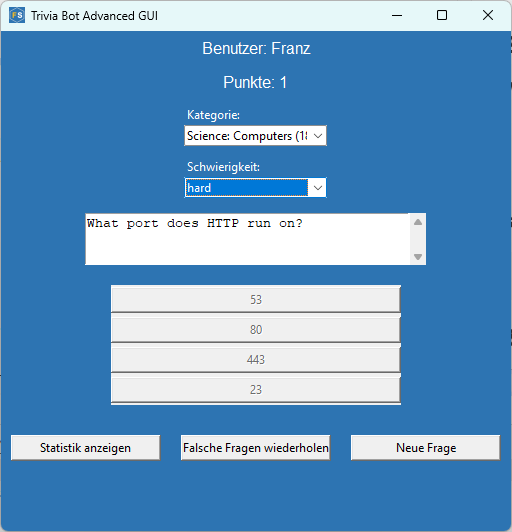
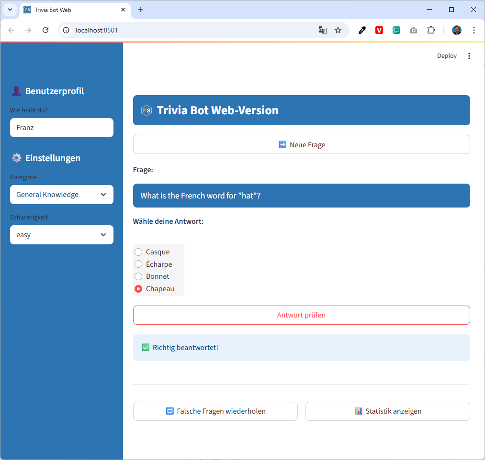

# Trivia-Chatbot


Ein interaktiver Quiz-Bot mit mehreren Oberflächen: **Kommandozeile (CLI)**, **grafische Benutzeroberfläche (GUI)** und **Web-App (Streamlit)**. Die Anwendung greift auf die [Open Trivia Database](https://opentdb.com/) zu und unterstützt Kategorien, Schwierigkeitsgrade, Punktestand und Wiederholungsfragen.

## Voraussetzungen

- Python **3.10+** (empfohlen)
- `pip` für Paketinstallation

## Installation

1. **Repository klonen oder Dateien lokal speichern**

2. **Virtuelle Umgebung einrichten** (optional, empfohlen):
   ```bash
   python -m venv .venv
   .venv\Scripts\activate
   ```

3. **Abhängigkeiten installieren:**

   ```bash
   pip install -r requirements.txt
   ```

#### Inhalt von `requirements.txt`

```txt
streamlit
requests
tk
```

* `streamlit` → für die Web-App (`trivia_bot_web.py`)
* `requests` → um Fragen von der Open Trivia API abzurufen
* `tk` → für die grafische GUI mit `tkinter`

## Varianten & Nutzung

Du kannst den Trivia-Bot in drei Varianten verwenden – je nach Vorliebe und Umgebung:

### 1. `trivia_bot.py` – CLI Anwendung (Textkonsole)

**Vorteile:**

* Sehr leichtgewichtig
* Keine externe GUI erforderlich
* Ideal für schnelle Nutzung in der Konsole

**Starten:**

```bash
python trivia_bot.py
```

### 2. `trivia_bot_gui.py` – GUI Anwendung (Tkinter)



**Vorteile:**

* Einfache grafische Oberfläche
* Ideal für lokal installierte Anwendungen
* Auch ohne Browser verwendbar

**Starten:**

```bash
python trivia_bot_gui.py
```

### 3. `trivia_bot_web.py` – Web Anwendung (Streamlit)



**Vorteile:**

* Modernes Web-Design mit Benutzerprofil, Statistik und Fehlerwiederholung
* Im Browser nutzbar
* Erweiterbar für Mehrnutzerbetrieb oder Hosting

**Starten:**

```bash
streamlit run trivia_bot_web.py
```

> Hinweis: Beim ersten Start kann es wenige Sekunden dauern, bis sich die Streamlit-App im Browser öffnet.

## Weitere Hinweise

* Der Trivia-Bot speichert deine Einstellungen (Benutzername, Kategorie, Schwierigkeitsgrad) in einer `config.json`.
* Falsch beantwortete Fragen können wiederholt werden.
* Punktestand und Statistik werden direkt angezeigt.

## Lizenz

Dieses Repository ist unter der [MIT-Lizenz](./LICENSE) veröffentlicht. Es ist zu Lernzwecken erstellt. Inhalte und Code dürfen frei verwendet und angepasst werden.


